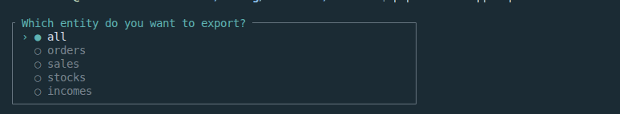
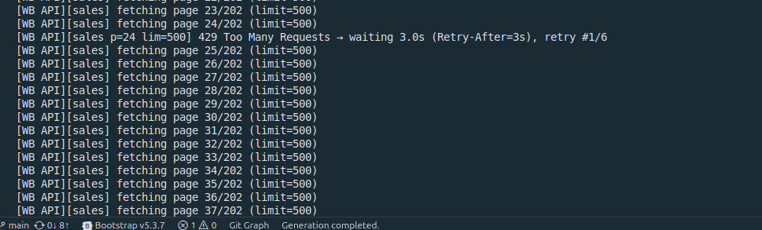
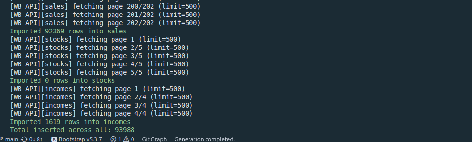

# WB Importer

## Требования

-   PHP 8+
-   Composer

## Подготовка

1. Клонировать репозиторий

2. Инициализировать приложение

-   (Linux)
    ```bash
    make init
    ```
-   Windows

    ```bash
    composer install

    copy .env.example .env

    php artisan key:generate
    ```

## Доступы к БД

Host: 5.129.198.137  
Port: 3306  
DB: elmikeev  
User: elmikeev  
Pass: elmikeev  
Названия таблиц: orders, sales, stocks, incomes

## CLI-команды

### Без указания сущности (промпт с выбором)

```bash
php artisan app:import --from 2025-07-10
```

### Импорт заказов

```bash
php artisan app:import orders --from=2025-08-01 --to=2025-08-10
```

### Импорт продаж

```bash
php artisan app:import sales --from=2025-08-01 --to=2025-08-10
```

### Импорт складов

```bash
php artisan app:import stocks --date=2025-08-10
```

### Импорт доходов

```bash
php artisan app:import incomes --from=2025-08-01 --to=2025-08-10
```

## Пример работы







## Идемпотентность

При тестировании API было обнаружено, что некоторые эндпоинты возвращают полностью идентичные записи в рамках одной страницы результата. Для предотвращения вставки дублей:

-   перед вставкой cчитается md5-хэш по всем полям сущности;
-   установлен уникальный индекс по этому хэшу.
